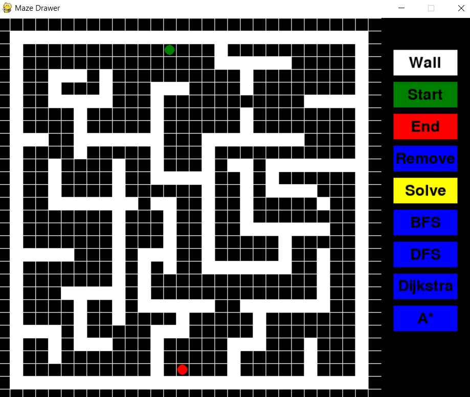
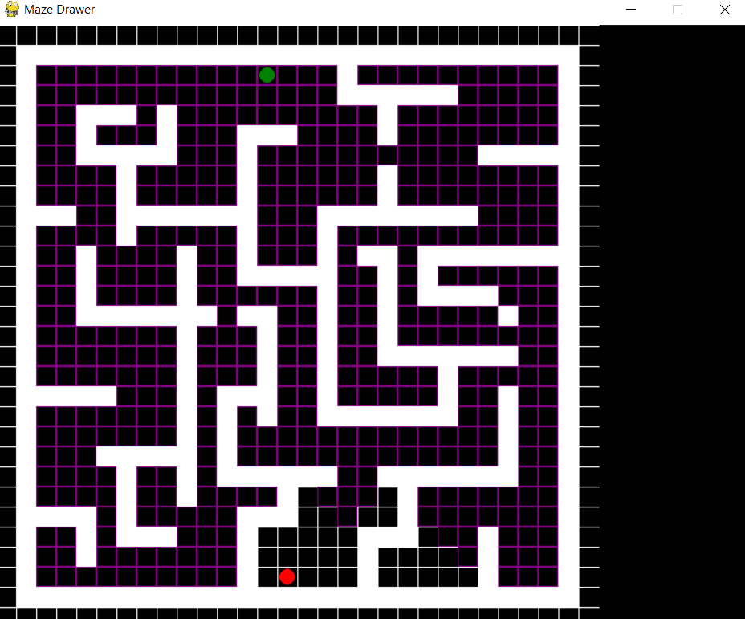
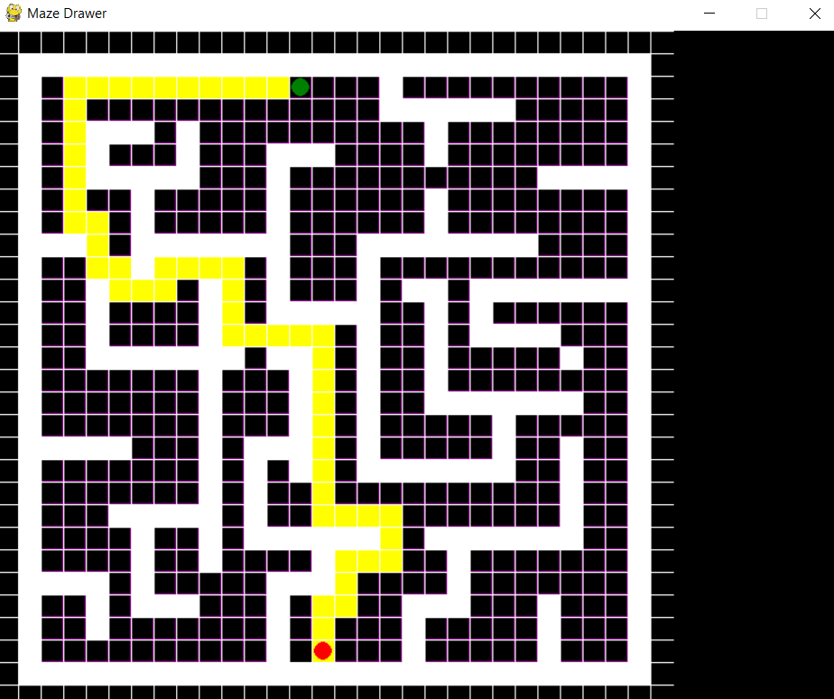

# Maze Visualisation

Maze Visualisation is a Python application using Pygame to visualize popular maze solving algorithms like BFS, DFS, Dijkstra, and A*. This tool helps in understanding the mechanics of these algorithms by providing a visual representation of their paths and decisions in real-time.

  



## Features

- **Interactive Drawing**: Draw walls, set start and end points to create custom mazes.
- **Visualise Algorithms**: Watch in real-time how algorithms like BFS, DFS, Dijkstra, and A* find their way through the maze.
- **Performance Metrics**: After the path is found, see metrics like "number of cells covered" to understand the efficiency of each algorithm.

## Getting Started

### Prerequisites

- Python 3.x
- Pygame

### Installation

1. Clone this repository:

```bash
git clone https://github.com/faw01/maze-visualisation.git
```

2. Navigate to the directory:

```bash
cd maze-visualisation
```

3. Install the required packages:

```bash
pip install pygame
```

### Usage

Run the `gui.py` script:

```bash
python gui.py
```

Follow the on-screen instructions to draw a maze, select an algorithm, and visualize the pathfinding process.

## Algorithms Explained

- **Breadth-First Search (BFS)**: Explores the closest nodes first before moving further, guaranteeing the shortest path.
- **Depth-First Search (DFS)**: Explores as far as possible before backtracking, not always resulting in the shortest path.
- **Dijkstra**: Finds the shortest path from the start to every position in the maze.
- **A***: Uses heuristics to prioritize paths that seem more promising, often resulting in faster solutions than Dijkstra.

## Future Enhancements

- Incorporate more algorithms like Kruskal, Prim, etc.
- Allow saving and loading of mazes.
- Improve performance for larger grid sizes.
